

  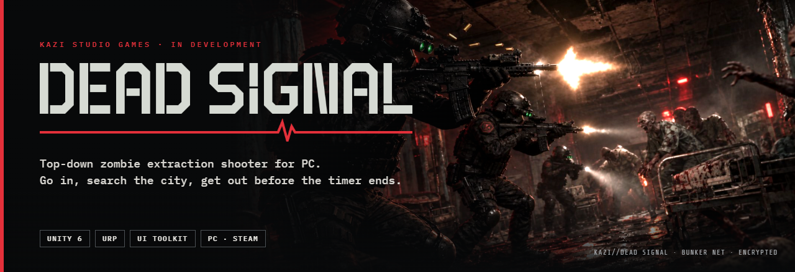

  
  
  
  
  

  <a href="#the-game">The game</a> ·
  <a href="#features">Features</a> ·
  <a href="#in-engine">In engine</a> ·
  <a href="#architecture">Architecture</a> ·
  <a href="#roadmap">Roadmap</a> ·
  <a href="#studio">Studio</a>

> This repository is the public page for **DEAD SIGNAL** by **KAZI Studio Games**. The game source is private. Technical write-ups are in [`docs/`](docs).

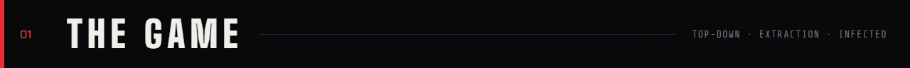

Go into an overrun city, search it, and get out before the timer ends. What you carry out is yours. Die and it stays behind.

| | |
|---|---|
| **Camera** | Top-down · 17 m |
| **Zones** | 6 · 25–45 min raids |
| **Infected types** | 5 |
| **Bunker rooms** | 12 |

  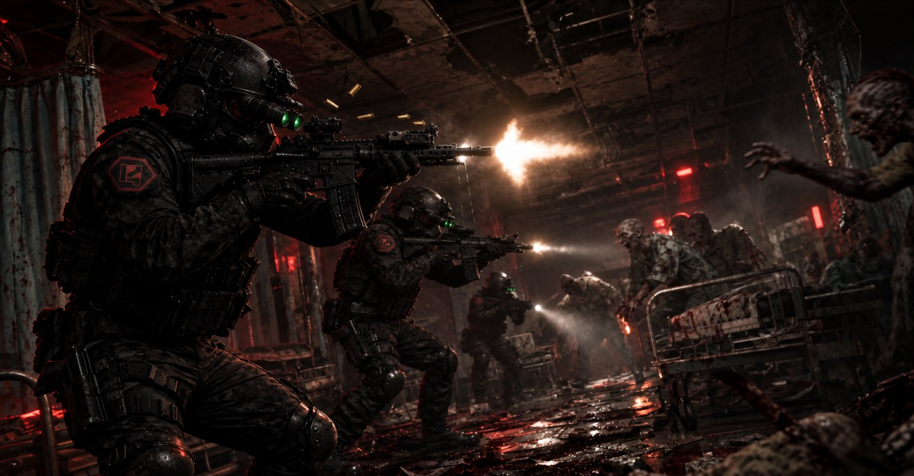
  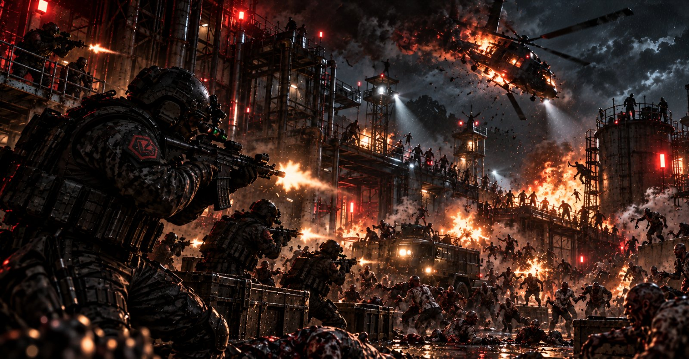

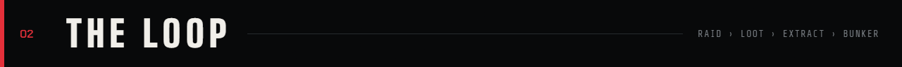

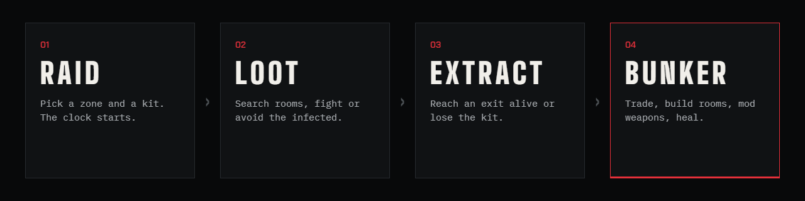

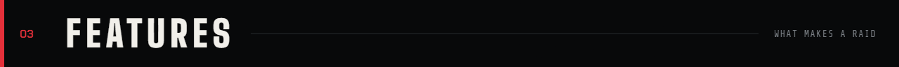

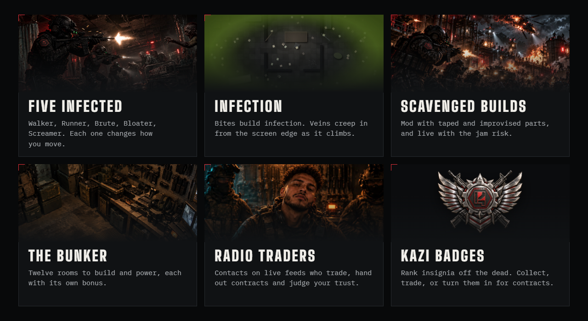

- **Five infected.** Walker, Runner, Brute, Bloater, Screamer. Each one changes how you move.
- **Infection.** Bites build infection. Veins creep in from the screen edge as it climbs.
- **Scavenged builds.** Mod with taped and improvised parts, and live with the jam risk.
- **The bunker.** Twelve rooms to build and power, each with its own bonus.
- **Radio traders.** Contacts on live feeds who trade, hand out contracts and judge your trust.
- **KAZI badges.** Rank insignia taken from the dead. Collect, sell, or turn them in for contracts.

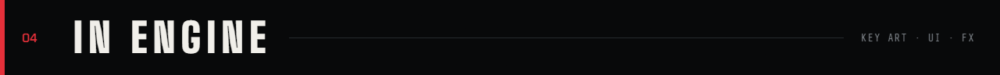

  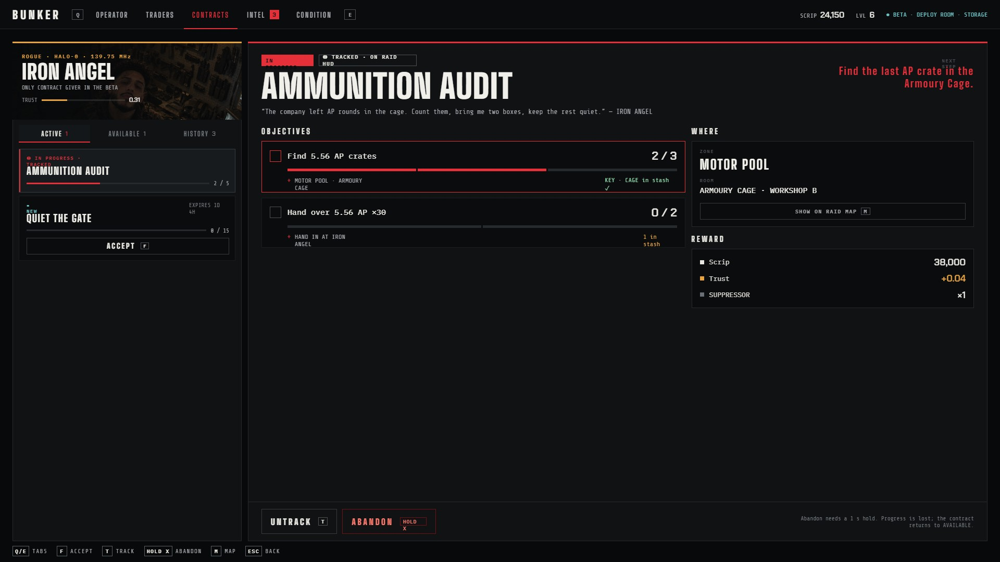

  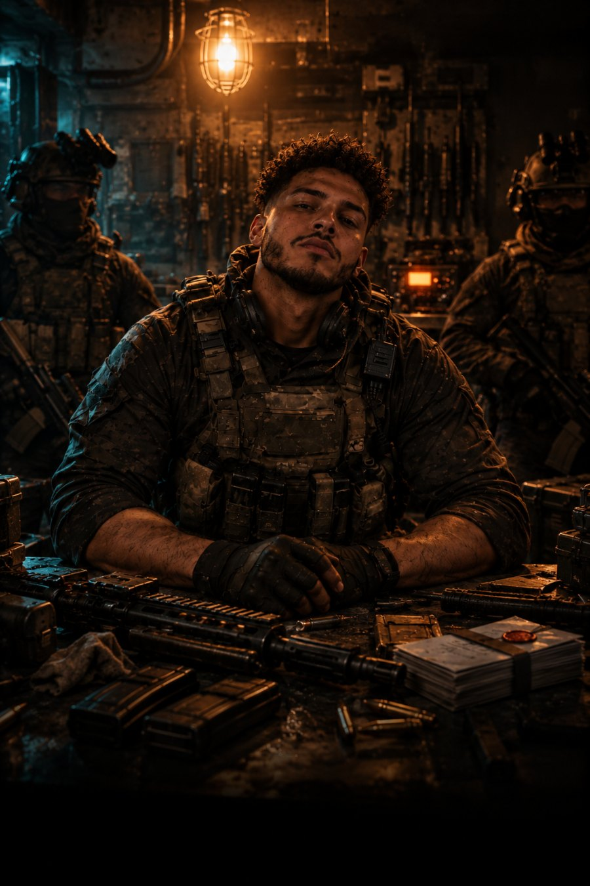
  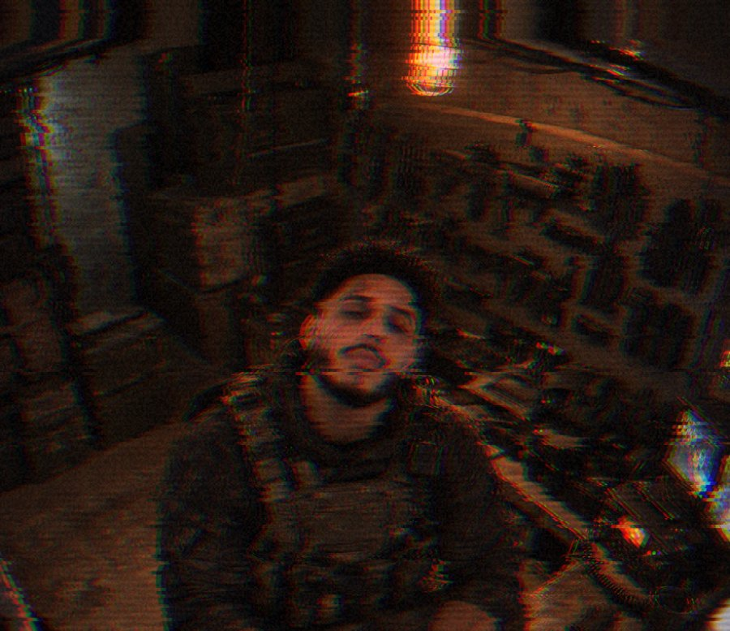
  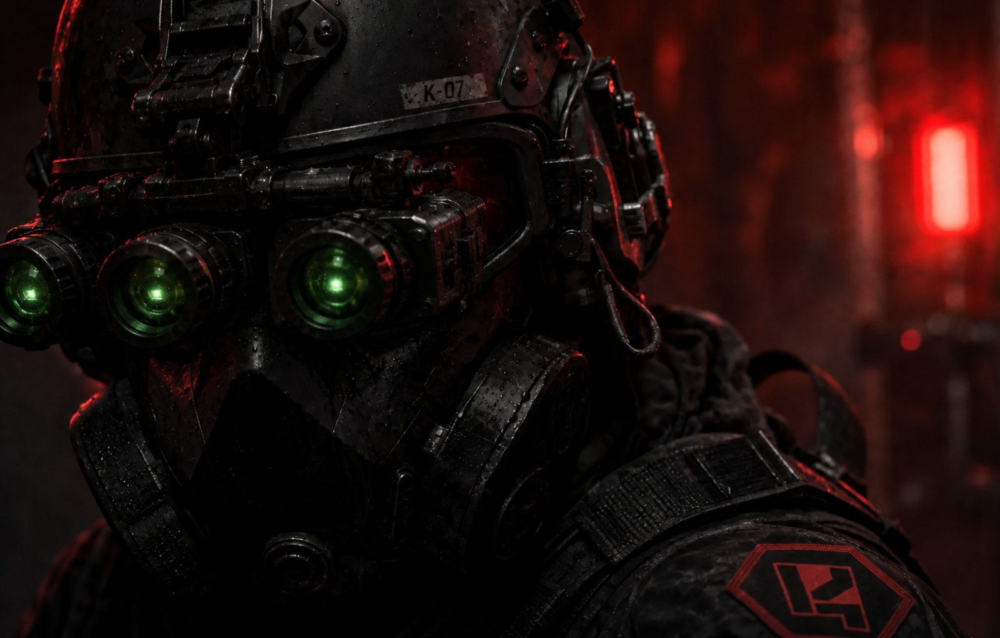

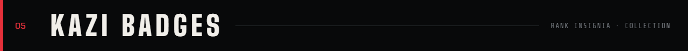

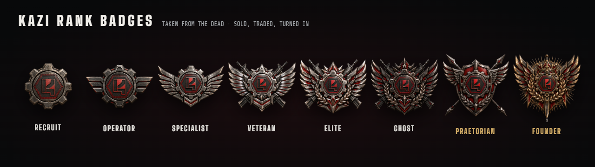

Every KAZI soldier carries a rank badge. Each one is a unique item: it records the callsign of the soldier who wore it and who killed them, and comes in pristine, scratched or bloodied condition. Contracts ask for them, traders buy them, and the collection screen tracks every rank.

  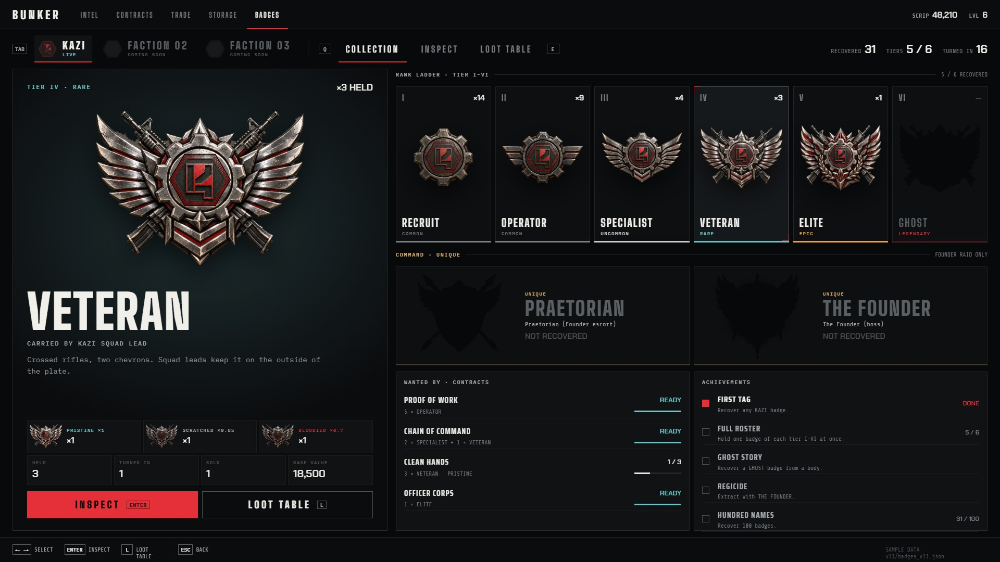

  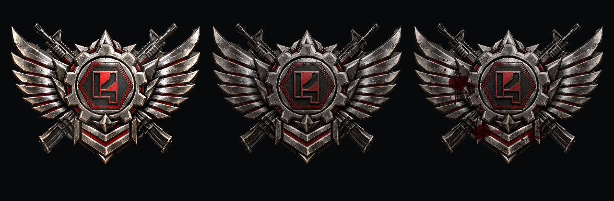

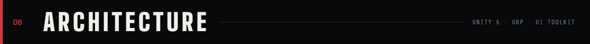

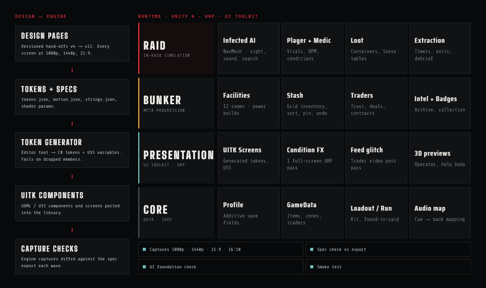

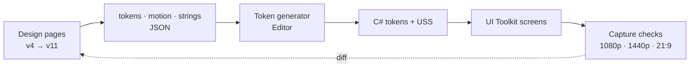

- **Runtime:** Unity 6, URP, UI Toolkit. Raid simulation, bunker meta progression, presentation and core data are separate layers.
- **One full-screen pass for conditions.** Infection, bleeding, low health, exhaustion and hit feedback combine in a single URP pass with one material and one draw.
- **Design system in the build.** Design hands off versioned tokens and specs. An editor generator turns them into C# and USS, and engine captures are diffed against the spec each wave.

Full write-up: [`docs/ARCHITECTURE.md`](docs/ARCHITECTURE.md)

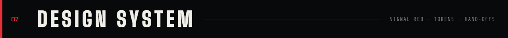

**Signal Red.** Void black, bone text, one red accent. Every screen ships at 1080p, 1440p and 21:9, with keyboard and gamepad prompts, colour-blind and reduce-motion modes.

| Token | Hex | Use |
|---|---|---|
| `void` | `#08090a` | Backgrounds |
| `panel` | `#101214` | Panels, cards |
| `bone` | `#e8e6e1` | Text |
| `accent` | `#e5303a` | Primary actions, selection, danger |
| `mint` | `#6fc2c4` | Success, ready |
| `trader-angel` | `#e8a33d` | Trader colour |

Type: Big Shoulders Display (titles), Chakra Petch (numbers), Share Tech Mono and IBM Plex Mono (labels, data), Saira Condensed (UI headings).

More: [`docs/DESIGN_SYSTEM.md`](docs/DESIGN_SYSTEM.md)

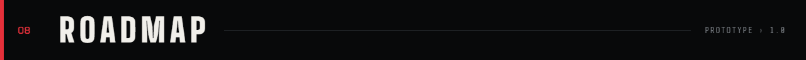

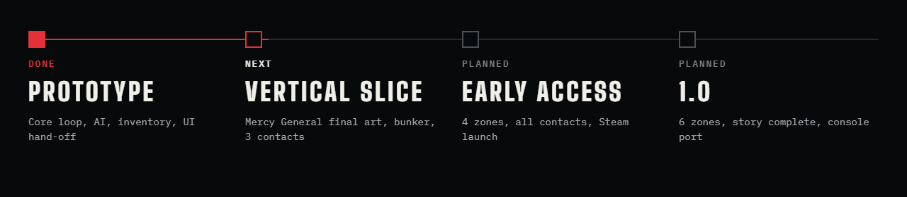

| Milestone | Status | Scope |
|---|---|---|
| Prototype | **Done** | Core loop, AI, inventory, UI hand-off |
| Vertical slice | Next | Mercy General final art, bunker, 3 contacts |
| Early Access | Planned | 4 zones, all contacts, Steam launch |
| 1.0 | Planned | 6 zones, story complete, console port |

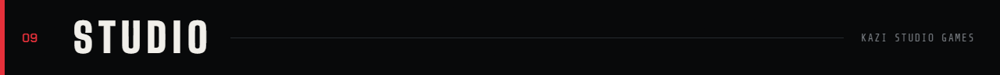

**KAZI Studio Games** builds DEAD SIGNAL. For investor, press or hiring enquiries, contact us through this GitHub organisation's profile.

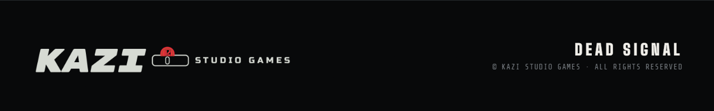

© KAZI Studio Games. All rights reserved. See [LICENSE.md](LICENSE.md) and [CREDITS.md](CREDITS.md).
