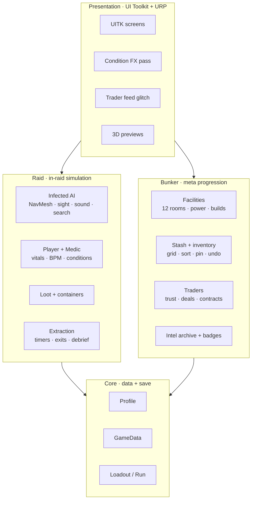
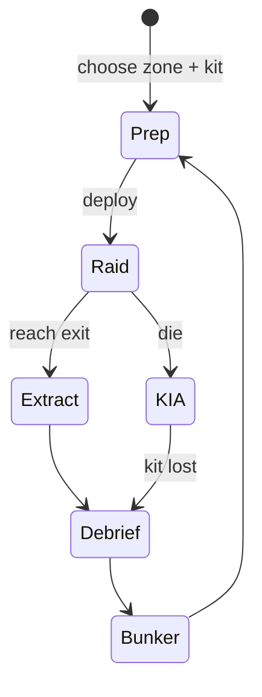
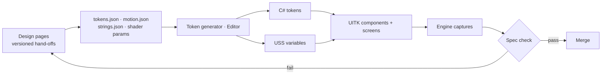

# Architecture

DEAD SIGNAL runs on **Unity 6** with **URP** and **UI Toolkit**. This page describes how the game is put together. Source is private.

## Layers

| Layer | Notes |
|---|---|
| Raid | Infected use NavMesh agents with sight, sound and search states. Vitals drive one heart rate that the HUD and screen effects share. |
| Bunker | Rooms, power, builds, stash. Progression gating sits behind a switch until levels are final. |
| Presentation | UI Toolkit screens built from generated tokens. 3D previews (operator, hologram body) render only while their screen is open. |
| Core | Save fields are additive, so the save version does not change between updates. |

## Raid loop

## Design → engine pipeline

- **Generated tokens.** An editor generator reads design's JSON and writes C# tokens and USS variables. It refuses to write a file that drops a member the code still uses, and lists any USS variable that is referenced but not defined (USS fails silently).
- **Ported components.** Design's UXML/USS templates are ported into the project's component library instead of being imported as-is, so letter-spacing and blending match Unity's renderer.
- **Old screens stay behind switches** until the new one is confirmed in play.
- **Checks every wave:** captures at 1080p, 1440p, 21:9 and 16:10; the spec check against the export; the UI foundation check; a smoke test.

## Rendering

**Condition effects: one full-screen URP pass.** Infection, bleeding, low health, exhaustion, hit jolt and KIA run in one Full Screen Pass Renderer Feature (After Rendering Post Processing, before UI), with one material and one draw. The centre 60 % of the screen stays clean so loot, doors and infected stay readable. Two data textures drive it: vein growth order and blood drop thresholds. States combine by rule (darkness multiplies, desaturation and blur take the max) so the tint never doubles.

**Trader feed glitch.** Trader video plays through a VideoPlayer into a RenderTexture, then a post pass adds 2 px row tearing, RGB split, dropouts and frame holds. Failed deals, low trust and closed deals each trigger their own reaction.

**3D previews.** The operator in the raid inventory and the hologram body on the condition screen render on a shared preview stage at about 30 fps, and sleep when their screen closes.

## Items: KAZI badges

Badges are unique, non-stacking items. Each instance stores rank, condition, the carrier's callsign, killer, weapon, zone and raid. A carrier's body holds the badge at its rank's on-body chance; if there is no body, the rank's loose table rolls instead. The data for every rank, loot table, quest and achievement is one JSON file that the design page and the game both read.

## Accessibility

Colour-blind mode swaps the semantic colours (accent, infection, success) and keeps every shape. Reduce motion freezes the heartbeat pulse, removes camera kick and halves blur. Every screen shows keyboard or gamepad prompts for the active device.
